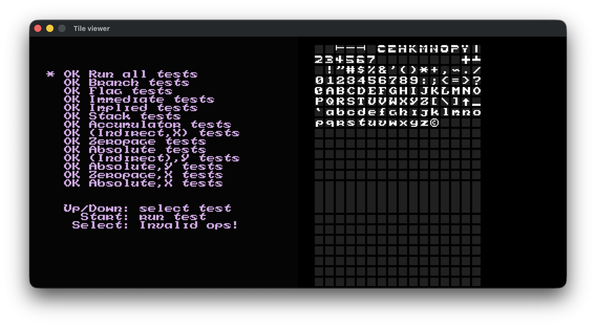
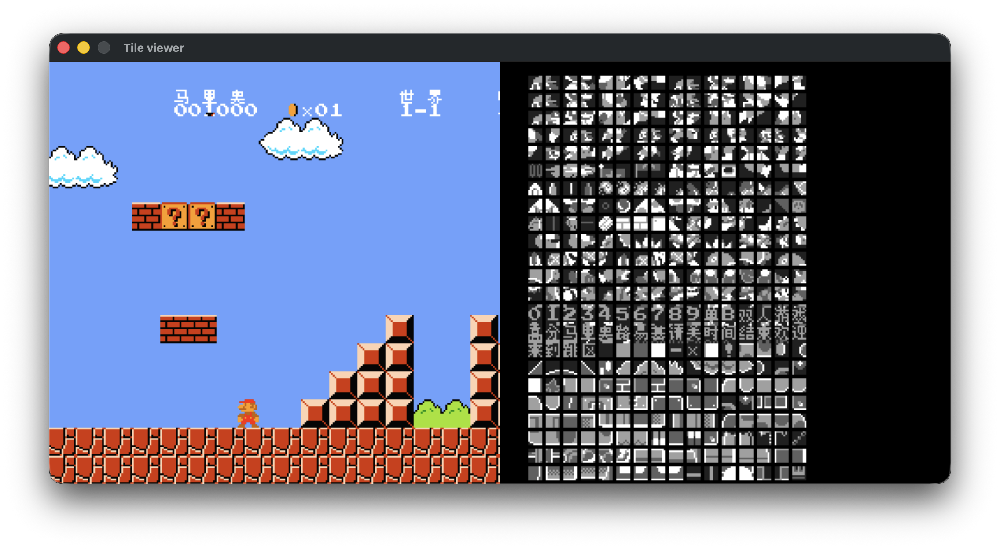

# NES Emulator C++ 代码架构分析文档

## 1. 项目概述

本项目是一个基于 C++ 实现的 NES（Nintendo Entertainment System）模拟器，采用 SDL2 进行图形渲染和输入处理。项目采用模块化设计，模拟了 NES 主机的核心组件：CPU、PPU、卡带、手柄和总线系统。

**技术栈：**
- C++17
- SDL2（图形渲染和输入）
- CMake 构建系统


## 2. 目录结构

```
nes_emulator/
├── CMakeLists.txt          # 构建配置
├── src/
│   ├── main.cpp            # 主程序入口
│   ├── bus.cpp / bus.h     # 地址总线
│   ├── cpu.cpp / cpu.h     # CPU 模拟 (MOS 6502)
│   ├── cartridge.cpp / cartridge.h  # 卡带/ROM 加载
│   ├── joypad.cpp / joypad.h        # 手柄输入
│   ├── mem.h               # 内存访问接口
│   ├── opcodes.cpp / opcodes.h      # 操作码定义
│   ├── trace.cpp / trace.h          # 调试跟踪
│   ├── ppu/
│   │   ├── ppu.cpp / ppu.h          # 图像处理单元
│   │   └── registers/
│   │       ├── control.h / control.cpp   # PPU 控制寄存器
│   │       ├── mask.h / mask.cpp         # PPU 遮罩寄存器
│   │       ├── status.h / status.cpp     # PPU 状态寄存器
│   │       ├── scroll.h / scroll.cpp     # 滚动寄存器
│   │       └── addr.h / addr.cpp         # 地址寄存器
│   └── render/
│       ├── render.cpp / render.h   # 渲染模块
│       ├── frame.cpp / frame.h     # 帧缓冲
│       └── palette.cpp / palette.h # 调色板
```

## 3. 模块详细分析

### 3.1 主程序入口 (main.cpp)

**功能：** 初始化 SDL2 窗口、加载 ROM、创建游戏循环、处理输入事件。

**关键数据结构：**
- `texture_data`: 存储渲染纹理数据（512×480 像素，RGB 格式）
- `key_map`: SDL 键盘码到手柄按钮的映射表

**关键函数：**
- `render_tile_viewer()`: 渲染 CHR ROM 瓦片查看器，显示 2 个 256 瓦片的存储体

**游戏循环回调：**
```cpp
[&](NesPPU& ppu, Joypad& joypad) {
    render::render(ppu, frame);           // 渲染背景和精灵
    render_tile_viewer(ppu, texture_data); // 渲染瓦片查看器
    SDL_UpdateTexture(...);                 // 更新纹理
    SDL_RenderPresent(renderer);            // 显示帧
    // 处理 SDL 事件（退出、按键）
}
```

### 3.2 总线系统 (bus.cpp / bus.h)

**功能：** 模拟 NES 地址总线，负责 CPU、RAM、PPU、卡带和手柄之间的数据路由。

**关键成员：**
| 成员 | 类型 | 说明 |
|------|------|------|
| `cpu_vram_` | `array<uint8_t, 2048>` | 2KB CPU 内部 RAM |
| `prg_rom_` | `vector<uint8_t>` | 程序 ROM |
| `ppu_` | `NesPPU` | 图像处理单元实例 |
| `joypad1_` | `Joypad` | 1 号手柄 |
| `cycles_` | `size_t` | 累计周期数 |

**地址映射：**

| 地址范围 | 访问组件 |
|----------|----------|
| 0x0000-0x1FFF | CPU RAM（镜像重复） |
| 0x2000-0x3FFF | PPU 寄存器（镜像重复） |
| 0x4000-0x4015 | APU/音频寄存器 |
| 0x4016-0x4017 | 手柄寄存器 |
| 0x4014 | OAM DMA 传输 |
| 0x8000-0xFFFF | PRG ROM |

**关键方法：**
- `tick(cycles)`: 每 CPU 周期调用，同时推进 PPU（PPU 1 周期 = CPU 3 周期）
- `poll_nmi_status()`: 检测并清除 NMI 中断标志

### 3.3 CPU 模拟 (cpu.cpp / cpu.h)

**功能：** 模拟 MOS 6502 微处理器，执行 NES 游戏代码。

**寄存器：**
| 寄存器 | 位宽 | 说明 |
|--------|------|------|
| `register_a` | 8-bit | 累加器 |
| `register_x` | 8-bit | 索引寄存器 X |
| `register_y` | 8-bit | 索引寄存器 Y |
| `status` | 8-bit | 处理器状态标志 |
| `program_counter` | 16-bit | 程序计数器 |
| `stack_pointer` | 8-bit | 栈指针（初始 0xFD） |

**状态标志位：**
```cpp
CARRY_FLAG_MASK        = 0x01  // 进位标志
ZERO_FLAG_MASK         = 0x02  // 零标志
INTERRUPT_DISABLE_MASK = 0x04  // 中断禁用
DECIMAL_MODE_MASK      = 0x08  // BCD 模式
BREAK_COMMAND_MASK     = 0x10  // 软件中断标志
OVERFLOW_FLAG_MASK     = 0x40  // 溢出标志
NEGATIVE_FLAG_MASK    = 0x80  // 负数标志
```

**寻址模式（10 种）：**
1. `Immediate`: 立即寻址
2. `ZeroPage`: 零页寻址
3. `ZeroPage_X` / `ZeroPage_Y`: 零页索引寻址
4. `Absolute`: 绝对寻址
5. `Absolute_X` / `Absolute_Y`: 绝对索引寻址
6. `Indirect_X` / `Indirect_Y`: 间接索引寻址
7. `NoneAddressing`: 隐含寻址

**指令执行流程：**
```
1. 获取操作码 (opcode)
2. 解析操作数地址
3. 执行指令
4. 总线 tick（推进 PPU 周期）
5. 检查 NMI 中断
6. 调用回调函数
```

**关键指令实现：**
- 算术：`ADC`（加法）、`SBC`（减法）
- 逻辑：`AND`、`EOR`、`ORA`
- 移位：`ASL`、`LSR`、`ROL`、`ROR`
- 分支：`BCC`、`BCS`、`BEQ`、`BNE`、`BMI`、`BPL`
- 堆栈：`PHA`、`PLA`、`PHP`、`PLP`

### 3.4 卡带模块 (cartridge.cpp / cartridge.h)

**功能：** 解析和加载 iNES 格式的 NES ROM 文件。

**Rom 数据结构：**
```cpp
struct Rom {
    vector<uint8_t> prg_rom;      // 程序 ROM (16KB 页)
    vector<uint8_t> chr_rom;      // 字符 ROM (8KB 页，图形数据)
    uint8_t mapper;               // mapper 编号
    Mirroring screen_mirroring;   // 屏幕镜像模式
};
```

**iNES 格式头部（16 字节）：**
| 偏移 | 内容 |
|------|------|
| 0-3 | "NES" + 0x1A 标识 |
| 4 | PRG ROM 大小（16KB 页数） |
| 5 | CHR ROM 大小（8KB 页数） |
| 6 | 标志位 0（mapper low、mirror、trainer） |
| 7 | 标志位 1（mapper high、NES2.0） |
| 8-15 | 保留 |

**镜像模式：**
- `Vertical`: 垂直镜像（Nametable 0↔2, 1↔3）
- `Horizontal`: 水平镜像（Nametable 0↔1, 2↔3）
- `FourScreen`: 四屏模式

### 3.5 手柄输入 (joypad.cpp / joypad.h)

**功能：** 模拟标准 NES 手柄，支持 8 个按钮。

**按钮定义：**
```cpp
enum class JoypadButton : uint8_t {
    RIGHT      = 0b10000000,
    LEFT       = 0b01000000,
    DOWN       = 0b00100000,
    UP         = 0b00010000,
    START      = 0b00001000,
    SELECT     = 0b00000100,
    BUTTON_B   = 0b00000010,
    BUTTON_A   = 0b00000001,
};
```

**手柄状态机：**
- `strobe_`: 0 = 正常读取模式，1 = 固定读取 A 按钮
- `button_index_`: 当前读取的按钮索引（0-7）
- `button_status_`: 8 个按钮的按下状态位掩码

**读操作行为：**
- 当 `strobe_ = 1` 时，始终返回 A 按钮状态
- 当 `strobe_ = 0` 时，返回当前按钮状态，然后自动递增索引

### 3.6 PPU 模拟 (ppu/ppu.cpp / ppu.h)

**功能：** 模拟 NES 图像处理单元，负责渲染 256×240 像素画面。

**核心数据结构：**
```cpp
class NesPPU {
    vector<uint8_t> chr_rom;           // 字符图形数据
    Mirroring mirroring;                // 镜像模式
    ControlRegister ctrl;               // PPUCTRL ($2000)
    MaskRegister mask;                  // PPUMASK ($2001)
    StatusRegister status;              // PPUSTATUS ($2002)
    ScrollRegister scroll;              // PPUSCROLL ($2005)
    AddrRegister addr;                  // PPUADDR ($2006)
    array<uint8_t, 2048> vram;         // 2KB 视频 RAM
    array<uint8_t, 256> oam_data;      // 精灵属性表
    array<uint8_t, 32> palette_table;   // 调色板数据
    uint16_t scanline;                  // 当前扫描线 (0-261)
    bool nmi_interrupt;                 // NMI 中断标志
};
```

**扫描线时序：**
- 每条扫描线 341 个 PPU 周期
- 扫描线 0-239: 可见画面
- 扫描线 241: 设置 VBLANK 标志，触发 NMI（如果启用）
- 扫描线 261: VBLANK 结束

**OAM（精灵属性表）结构：**
每个精灵 4 字节：
- Y 坐标
- 瓦片索引
- 属性（翻转、优先级、调色板）
- X 坐标

### 3.7 PPU 寄存器模块

#### 3.7.1 控制寄存器 (control.h/cpp)

**地址：** $2000

**位定义：**
| 位 | 名称 | 功能 |
|----|------|------|
| 0-1 | NAMETABLE1/2 | 名称表地址选择 |
| 2 | VRAM_ADD_INCREMENT | VRAM 地址增量（1 或 32） |
| 3 | SPRITE_PATTERN_ADDR | 精灵图形地址（0x1000 或 0x0000） |
| 4 | BACKROUND_PATTERN_ADDR | 背景图形地址 |
| 5 | SPRITE_SIZE | 精灵大小（8×8 或 8×16） |
| 6 | MASTER_SLAVE_SELECT | 主/从模式 |
| 7 | GENERATE_NMI | VBLANK 时生成 NMI |

#### 3.7.2 遮罩寄存器 (mask.h/cpp)

**地址：** $2001

**位定义：**
| 位 | 名称 | 功能 |
|----|------|------|
| 0 | GREYSCALE | 灰度模式 |
| 1 | LEFTMOST_8PXL_BACKGROUND | 显示左侧 8 像素背景 |
| 2 | LEFTMOST_8PXL_SPRITE | 显示左侧 8 像素精灵 |
| 3 | SHOW_BACKGROUND | 显示背景 |
| 4 | SHOW_SPRITES | 显示精灵 |
| 5-7 | EMPHASISE_R/G/B | 颜色增强 |

#### 3.7.3 状态寄存器 (status.h/cpp)

**地址：** $2002

**位定义：**
| 位 | 名称 | 功能 |
|----|------|------|
| 5 | SPRITE_OVERFLOW | 精灵溢出标志 |
| 6 | SPRITE_ZERO_HIT | 精灵 0 碰撞标志 |
| 7 | VBLANK_STARTED | VBLANK 开始标志 |

**读取行为：** 读取后自动清除 VBLANK 标志和地址锁存器。

#### 3.7.4 滚动寄存器 (scroll.h/cpp)

**功能：** 双重写入寄存器，用于设置背景滚动偏移。
- 第一次写入 → scroll_x
- 第二次写入 → scroll_y
-  latch 标志交替切换

#### 3.7.5 地址寄存器 (addr.h/cpp)

**功能：** 双重写入 PPU 地址寄存器。
- 第一次写入 → 高字节
- 第二次写入 → 低字节
- 支持自动增量（1 或 32）

### 3.8 渲染模块 (render/)

#### 3.8.1 帧缓冲 (frame.h/cpp)

**功能：** 管理 256×240 分辨率的帧缓冲。

**数据结构：**
```cpp
class Frame {
    vector<uint8_t> data_;  // RGB 数据，256×240×3 字节
};
```

**关键方法：**
- `set_pixel(x, y, r, g, b)`: 设置像素（带边界检查）
- `get_data()`: 获取原始 RGB 数据

#### 3.8.2 调色板 (palette.h/cpp)

**功能：** 定义 NES 的 64 色系统调色板。

```cpp
static const array<array<uint8_t, 3>, 64> SYSTEM_PALETTE;
```

#### 3.8.3 渲染器 (render.h/cpp)

**命名空间：** `render`

**主要函数：**
```cpp
void render(const NesPPU& ppu, Frame& frame);
```

**渲染流程：**
1. 获取当前名称表地址
2. 根据镜像模式确定主/次名称表
3. 渲染主名称表（应用滚动偏移）
4. 如果有滚动溢出，渲染次名称表
5. 渲染精灵（从 OAM 倒序读取，优先级低的先渲染）

**瓦片渲染（8×8 像素）：**
```
每个瓦片使用 CHR ROM 中 16 字节：
- 低位平面 (bit 0): tile[y] (y=0..7)
- 高位平面 (bit 1): tile[y+8] (y=0..7)

像素值 = ((高位 & 1) << 1) | (低位 & 1)
```

**精灵渲染特性：**
- 支持水平/垂直翻转
- 透明像素（值=0）跳过
- 优先级处理（后渲染覆盖先渲染）

### 3.9 操作码定义 (opcodes.cpp / opcodes.h)

**功能：** 定义 6502 指令集的操作码、元数据（长度、周期数）和寻址模式。

**OpCode 结构：**
```cpp
struct OpCode {
    uint8_t code;              // 操作码
    const char* mnemonic;       // 助记符
    uint8_t len;               // 指令长度（字节）
    uint8_t cycles;            // 执行周期数
    AddressingMode mode;       // 寻址模式
};
```

**支持的操作码示例：**
| 操作码 | 指令 | 长度 | 周期 |
|--------|------|------|------|
| 0xA9 | LDA Immediate | 2 | 2 |
| 0x6D | ADC Absolute | 3 | 4 |
| 0x4C | JMP Absolute | 3 | 3 |

### 3.10 调试跟踪 (trace.cpp / trace.h)

**功能：** 生成 CPU 指令执行跟踪信息，用于调试。

**输出格式：**
```
PC    OPCODE  MNEMONIC  OPERAND    A:XX X:XX Y:XX P:XX SP:XX
```

## 4. 数据流与架构图

### 4.1 系统架构

```
┌─────────────────────────────────────────────────────────────────┐
│                         main.cpp                                 │
│  ┌──────────────┐  ┌──────────────┐  ┌──────────────┐            │
│  │   SDL2       │  │  游戏循环     │  │  输入处理    │            │
│  │  窗口/渲染    │  │  回调         │  │  事件        │            │
│  └──────────────┘  └──────────────┘  └──────────────┘            │
└────────────────────────────┬────────────────────────────────────┘
                             │
                             ▼
┌─────────────────────────────────────────────────────────────────┐
│                           Bus                                   │
│  ┌────────────┐  ┌────────────┐  ┌────────────┐  ┌────────────┐ │
│  │  CPU       │  │  PPU       │  │  卡带      │  │  手柄      │ │
│  │  (6502)   │  │  渲染      │  │  PRG ROM   │  │  Joypad1   │ │
│  └────────────┘  └────────────┘  └────────────┘  └────────────┘ │
│         │              │               │                         │
│         │              │               │                         │
│         ▼              ▼               ▼                         │
│  ┌────────────┐  ┌────────────┐  ┌────────────┐                  │
│  │  CPU RAM   │  │  VRAM     │  │  CHR ROM   │                  │
│  │  2KB      │  │  2KB      │  │  图形      │                  │
│  └────────────┘  └────────────┘  └────────────┘                  │
└─────────────────────────────────────────────────────────────────┘
```

### 4.2 游戏循环数据流

```
┌─────────────────────────────────────────────────────────────────┐
│                     游戏循环 (每帧 ~60fps)                        │
└─────────────────────────────────────────────────────────────────┘
                              │
                              ▼
┌─────────────────────────────────────────────────────────────────┐
│  CPU::run_with_callback()                                        │
│  ┌─────────────────────────────────────────────────────────────┐│
│  │ 1. 取指 (fetch opcode)                                      ││
│  │ 2. 译码 (lookup opcode info)                                ││
│  │ 3. 执行 (execute instruction)                               ││
│  │ 4. 总线 tick ────────────────────────────────────────────►   ││
│  │                           │                                  ││
│  │                           ▼                                  ││
│  │                    Bus::tick(cycles)                         ││
│  │                           │                                  ││
│  │                           ▼                                  ││
│  │              PPU::tick(cpu_cycles * 3)                       ││
│  │                           │                                  ││
│  │              检测 VBLANK/NMI ─────────────────────────────► ││
│  │                           │                                  ││
│  │                           ▼                                  ││
│  │              回调 (gameloop_callback)                       ││
│  │                           │                                  ││
│  │                           ▼                                  ││
│  │         render::render(ppu, frame) ──────► 渲染画面         ││
│  └─────────────────────────────────────────────────────────────┘│
└─────────────────────────────────────────────────────────────────┘
```

### 4.3 PPU 渲染流程

```
┌─────────────────────────────────────────────────────────────────┐
│                        PPU 渲染周期                              │
├─────────────────────────────────────────────────────────────────┤
│                                                                  │
│  扫描线 0-239 (可见画面):                                        │
│  ┌────────────────────────────────────────────────────────────┐ │
│  │ for each cycle (0-340):                                    │ │
│  │   - 读取名称表/属性表                                       │ │
│  │   - 读取背景瓦片数据                                       │ │
│  │   - 读取精灵数据                                           │ │
│  │   - 混合输出像素                                           │ │
│  └────────────────────────────────────────────────────────────┘ │
│                                                                  │
│  扫描线 241 (VBLANK):                                           │
│  ┌────────────────────────────────────────────────────────────┐ │
│  │ - 设置 VBLANK 标志                                         │ │
│  │ - 如果 ctrl.generate_vblank_nmi() → 触发 NMI              │ │
│  └────────────────────────────────────────────────────────────┘ │
│                                                                  │
│  扫描线 261 (VBLANK 结束):                                      │
│  ┌────────────────────────────────────────────────────────────┐ │
│  │ - 清除 VBLANK 标志                                         │ │
│  │ - 清除精灵碰撞标志                                          │ │
│  │ - 重置扫描线计数器                                         │ │
│  └────────────────────────────────────────────────────────────┘ │
│                                                                  │
└─────────────────────────────────────────────────────────────────┘
```

### 4.4 内存地址映射

```
┌────────────────┬────────────────────────────────┬────────────────┐
│    地址范围     │           组件                 │   说明         │
├────────────────┼────────────────────────────────┼────────────────┤
│ 0x0000-0x1FFF │ CPU RAM (2KB, 镜像×4)          │ 零页/栈/通用   │
├────────────────┼────────────────────────────────┼────────────────┤
│ 0x2000-0x3FFF │ PPU 寄存器 (8个, 镜像×4)      │ 控制/状态/数据 │
│                ├────────────────────────────────┤                │
│                │ $2000 │ PPUCTRL   │ 控制寄存器 │                │
│                │ $2001 │ PPUMASK   │ 遮罩寄存器 │                │
│                │ $2002 │ PPUSTATUS │ 状态寄存器 │                │
│                │ $2003 │ OAMADDR   │ OAM 地址   │                │
│                │ $2004 │ OAMDATA   │ OAM 数据   │                │
│                │ $2005 │ PPUSCROLL │ 滚动寄存器 │                │
│                │ $2006 │ PPUADDR   │ VRAM 地址  │                │
│                │ $2007 │ PPUDATA   │ VRAM 数据  │                │
├────────────────┼────────────────────────────────┼────────────────┤
│ 0x4000-0x4013 │ APU 寄存器                     │ 音频处理       │
│ 0x4014        │ OAM DMA                         │ 精灵数据传输   │
│ 0x4015        │ APU 状态                        │ 音频状态       │
│ 0x4016-0x4017 │ 手柄 1/2                        │ 输入读取       │
├────────────────┼────────────────────────────────┼────────────────┤
│ 0x8000-0xFFFF │ PRG ROM (最多 32KB)            │ 程序代码       │
│                ├────────────────────────────────┤                │
│                │ $FFFA-$FFFB │ NMI 向量         │                │
│                │ $FFFC-$FFFD │ RESET 向量       │                │
│                │ $FFFE-$FFFF │ IRQ/BRK 向量     │                │
└────────────────┴────────────────────────────────┴────────────────┘
```

## 5. 关键算法说明

### 5.1 6502 ADC（加法）算法

```cpp
void CPU::add_to_register_a(uint8_t data) {
    uint16_t sum = register_a + data + ((status & CARRY_FLAG_MASK) ? 1 : 0);

    // 进位检测
    if (sum > 0xFF) {
        set_carry_flag();
    } else {
        clear_carry_flag();
    }

    // 溢出检测 (补码溢出)
    if ((data ^ result) & (result ^ register_a) & 0x80) {
        status |= OVERFLOW_FLAG_MASK;
    } else {
        status &= ~OVERFLOW_FLAG_MASK;
    }

    set_register_a(result);
}
```

**溢出判断逻辑：** 当两个正数相加得到负数，或两个负数相加得到正数时发生溢出。

### 5.2 瓦片像素解码

```cpp
// 从 CHR ROM 读取瓦片数据
const uint8_t* tile = &ppu.chr_rom[bank + tile_idx * 16];

for (int y = 0; y <= 7; y++) {
    uint8_t upper = tile[y];      // 位平面 1
    uint8_t lower = tile[y + 8];  // 位平面 0

    for (int x = 7; x >= 0; x--) {
        // 提取 2 位像素值 (0-3)
        uint8_t value = ((lower & 1) << 1) | (upper & 1);
        upper >>= 1;
        lower >>= 1;

        // value 决定调色板索引
        // 0 = 透明，1/2/3 = 调色板颜色
    }
}
```

### 5.3 名称表地址镜像

```cpp
uint16_t NesPPU::mirror_vram_addr(uint16_t addr) const {
    uint16_t mirrored = addr & 0b10111111111111;  // 清除高位
    uint16_t vram_index = mirrored - 0x2000;      // 转 VRAM 索引
    uint16_t name_table = vram_index / 0x400;     // 名称表编号 (0-3)

    switch (mirroring) {
        case Mirroring::Vertical:
            // 垂直镜像: 0↔2, 1↔3
            if (name_table >= 2) vram_index -= 0x800;
            break;
        case Mirroring::Horizontal:
            // 水平镜像: 0↔1, 2↔3
            if (name_table == 2 || name_table == 1) vram_index -= 0x400;
            if (name_table == 3) vram_index -= 0x800;
            break;
        // FourScreen 不做镜像
    }
    return vram_index;
}
```

### 5.4 分支指令偏移计算

```cpp
void CPU::branch(bool condition) {
    if (condition) {
        int8_t offset = mem_read(program_counter);  // 带符号偏移
        uint16_t target = (program_counter + 1) + offset;
        program_counter = target;
    }
}
```

**注意：** 6502 分支指令的偏移是相对于下一条指令地址的有符号字节。

### 5.5 堆栈操作

```cpp
void CPU::stack_push(uint8_t data) {
    mem_write(STACK + stack_pointer, data);
    stack_pointer = (stack_pointer - 1) & 0xFF;  // 向下生长
}

uint8_t CPU::stack_pop() {
    stack_pointer = (stack_pointer + 1) & 0xFF;  // 向上收缩
    return mem_read(STACK + stack_pointer);
}

void CPU::stack_push_u16(uint16_t data) {
    stack_push((data >> 8) & 0xFF);  // 高字节先入
    stack_push(data & 0xFF);          // 低字节后入
}
```

**6502 堆栈特性：** 堆栈固定在 0x0100-0x01FF，高地址向下生长。

## 6. 构建说明

**依赖：**
- CMake 3.10+
- SDL2 开发库

**构建步骤：**
```bash
cd nes_emulator
mkdir -p build && cd build
cmake ..
make
```

**运行：**
```bash
./nes_emulator <rom_file.nes>
```

**键盘映射：**
| 键 | 手柄按钮 |
|----|----------|
| 方向键 | 方向 |
| Enter | Start |
| Space | Select |
| A | B 按钮 |
| S | A 按钮 |
| Esc | 退出 |

## 截图





## 参考

1. [Nesdev_Wiki](https://www.nesdev.org/wiki/Nesdev_Wiki)
2. [Writing NES Emulator in Rust](https://bugzmanov.github.io/nes_ebook/index.html)
